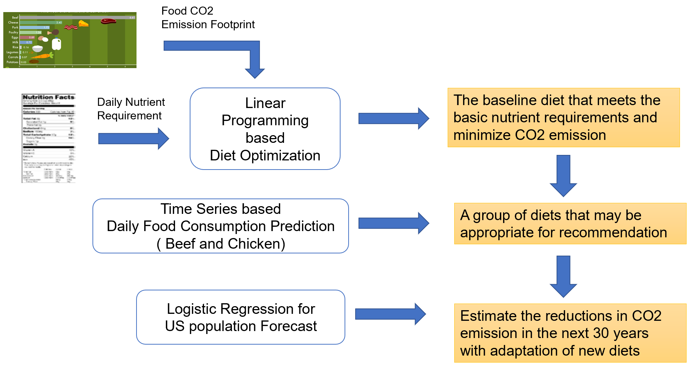

We introduce a framework for recommending environment-friendly diets for average Americans and forecasting the effectiveness of such an approach if it is widely accepted by society. This framework consists of the following major steps: diet optimization, prediction of individual food consumption and US population forecast. 

- Linear Programming based Diet Optimization: 

In this step, the algorithm determines the optimal environment-friendly diet to meet the basic nutrient requirements of individuals and minimize its CO2 emission. Such an optimization problem can be formulated as a linear programming process, in which we define the essential nutrient consumption as optimization constraints and designate the CO2 emission amount as the optimization goal.   

Assume the major food items in our daily lives include beef, lamb, potatoes and so on. We define variable $X_i$ to represent annual consumption amount of each food item $i$, and $C_i$ to represent the CO2 emission footprint of the food item $i$. Then, $C_i×X_i$ denotes the CO2 emission caused by the food item i every year. The main goal of the algorithm is to minimize the total emission of all the food items in our daily diet $Min(\sum(C_i×X_i)$. 

Let us assume that each unit of the food item i contain a certain amount of nutrient ingredients such as protein and vitamins. We donate $S_i^k≥0$  as the nutrient constitute  $k$ of the food $i$. Nutrient requirement for the ingredient $k$ can be formalized as $n_k≤\sum S_i^kX_i≤n_h$, where $n_k$ and $n_h$ represent the lower bound and upper bound for the daily consumption of the ingredient $k$. US Food and Agriculture department releases diet guidelines ever year, which recommends the approximate amount for each ingredient. 

- Prediction of individual food consumption per year: 

It is not trivial to recommend a new diet to people, which needs them to change their eating habits. Recent studies have been made to find effective ways to influence people to adopt new diets. They develop intelligent mobile apps to scan food receipts, calculate their carbon footprint and give people advice on what to substitute for the sake of reducing CO2 emission.  Considering the wide adoption of new optimized diets, food consumption will vary over the years. We can predict the future food consumption using time series methods. The autoregressive AR-p model is a widely used method to predict future trends based on historical data. The process is basically a linear regression of the data in the current series against one or more past values in the same series.

The notation $AR(p)$ indicates au autoregressive model of order $p$. The $AR(p)$ model is defined as 
$X_t=\sum_{i=1}^p phi_i X_t-i + epson_t$

In our case, we can observe the annual consumption of different food items such as beef and chicken in the past decades. If we wish to advise consumers to replace beef with other food items with much lower CO2 emission footprint, we can use AR-p to predict how people’s diet may change in the next two decades. In this way, we can verify the feasibility of adopting the optimized diets that are generated by our algorithm. 
