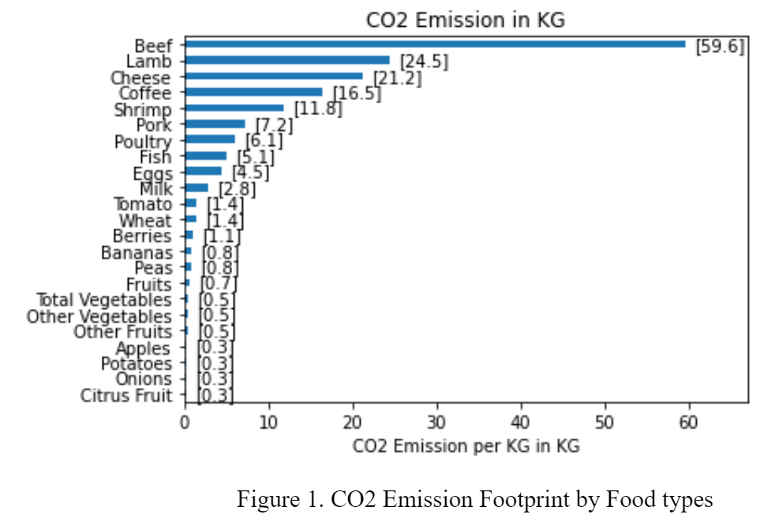
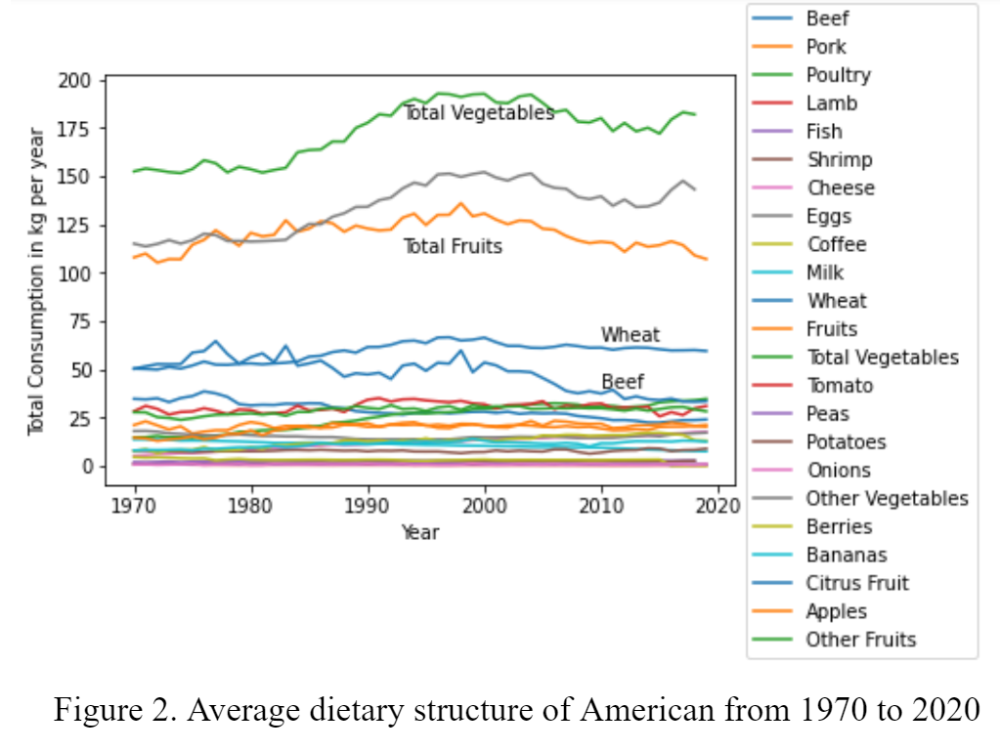
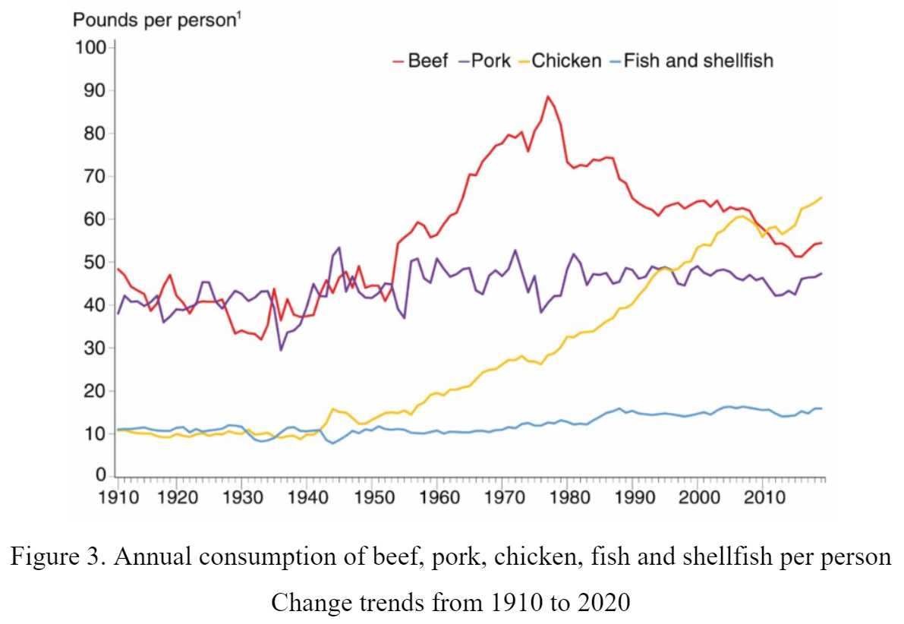
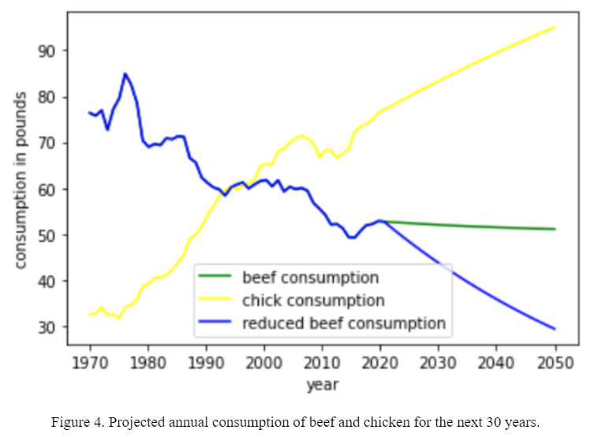
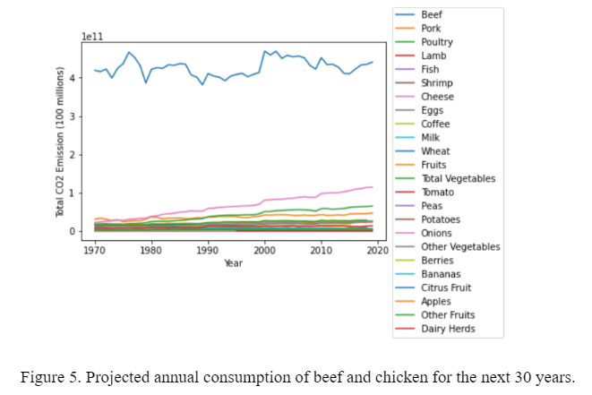
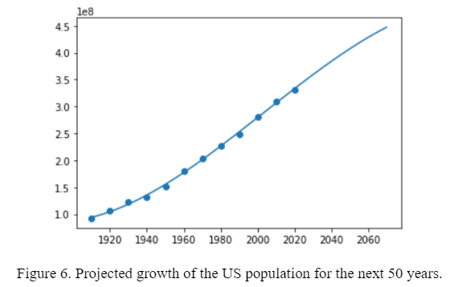

Firstly, we analyze the impact of food production on CO2 emission and identify the key contributors to CO2 emission during the Food Production process. Figure 1 displays a bar chart on CO2 footprint by food type. Among all the food types, beef ranks the top position in their CO2 emission footprint. The other meat types such as lamb, shrimp, pork and poultry follow the beef with much lower CO2 emission. 

Secondly, we can take a look at the dietary structure of US people from 1970 to 2020, which is shown in Figure 2. Vegetables and fruits occupy the majority quantities in average dietary structure. Given their very low CO2 emission footprint, it is a good choice for Americans to have more vegetables and fruits in their plate. The major problem is the large quantity of beef consumption because beef’s extremely high CO2 emission footprint. Although the consumption of beef seems to drop from the 1980s, it is still much higher than any other meat types. This observation indicates that we should keep improving our dietary structure, especially lower beef consumption to significantly reduce the environmental impact of beef-related food production. 

We run the linear programming algorithm discussed in the previous section to generate the optimal diet for reducing CO2 emission. The result is quite straightforward: if the optimization goal is configured as minimization of CO2 emission, the algorithm recommends people to mainly have vegetables and wheat as their daily food and completely give up beef in their plates. Even with the nutrient constraints such as protein and vitamin intakes, the algorithm still tends to deliver suggestions of replacing meat with plant-based food, especially beef. But such a radical transformation of eating habits must require significant behavior changes. Therefore, it takes gradual steps to persuade average Americans to replace beef with other food types that have a lower CO2 emission footprint. From the perspective of cuisine culture and eating tradition, it is more reasonable to recommend people to change beef with other meat types, for example chicken. 

Americans consume around 274 pounds of meat per year on average, not accounting for seafood and fish, or individual food waste. The total amount of meat consumed in the U.S. has increased by 40 percent since 1961. In 2017, the U.S. Department of Agriculture (USDA) reported that Americans are exceeding the amount of meat recommended by national dietary guidelines, although women in the U.S. eat about a third less meat than men, and around 42 percent less beef.

Figure 3 displays how many pounds of beef, pork, chicken, fish and shellfish have been eaten per person. Clearly, the consumption of pork, fish and shellfish remained steady from the year 1910 to 2020. The major change occurs in the amount of beef and chicken. Traditionally, US people prefer beef over chicken in their diet. Since the 1950s, consumption of beef and chicken have kept rising. But such a trend had a fundamental change in 1980, when people’s favor towards beef started decreasing. The growing popularity of chicken in the U.S. is linked to beef falling out of favor. For decades, consumers have been choosing chicken over beef due to health and environmental concerns. Nowadays, the consumption of chicken has exceeded that of beef, which indicates a feasible diet structure with more chicken over beef. 

Based on the historical data, we can forecast the consumption quantity of beef and chicken over the next 30 years. We use an autoregressive model to predict the future trend based on the previous consumption data from 1970 to 2020. Figure 4 plots the projected result, displaying the chick consumption curve in yellow and beef consumption curve in red. The AR model tends to give a nearly constant prediction of per capita beef consumption. Here, we assume that the new diet of replacing beef with chicken is successfully accepted by average Americans, which can result in exponential decrease in annual beef consumption. Suppose every one reduces 2% of the amount of beef per year. We have a new beef curve in blue: $X_{beef}^{t+1}=X_{beef}^t * 0.98^t$.

Before we can evaluate the effectiveness of adopting this new environment-friendly diet, we need to check the overall CO2 emission from current diet structure. With the multiplication of the US population, food consumption and CO2 emission footprint and quantity, we can estimate how many CO2 emissions food production can yield. Obviously, beef’s CO2 emission dominates the major part of the entire food system. 

In order to estimate the reduction effectiveness of our optimized diet over the current diet structure, we forecast the growth of the US population over the next 30 years. Figure 6 shows the regression result for predicting the US population. According to the current growth rate, the US population will increase from about 300 million at current time to more than 400 million in 2060. The steady increase in population will bring more CO2 emission and exacerbate global warming if we don’t make active initiative in reshaping our diet structure. 

With the projected US population, we can make the following analysis on how the change in our dietary structure can contribute to reducing carbon emission and improve the global environment. 
- (1) Total CO2 emission: 

We can estimate CO2 emission caused by beef consumption over the next 30 years will reach 29723 million tons in total. 

- (2) Reduced CO2 emission: 

As predicted in Figure 4, people will eat more chicken and less beef in the next 30 years. If their diet structure evolves according to the trend, we can achieve the goal of gradually replacing beef with chicken. Under this evolving diet structure, the CO2 emission will reach 24097 million tons in the next 30 years. Therefore, this effort can significantly reduce CO2 emission by a total 5626 million tons, which is nearly 19% of the predicted total CO2 emission under current diet structure. 

- (3) Comparison with tree’s CO2 neutralization: 

Forest is well known to play the role of carbon sink, which can significantly neutralize CO2 in the atmosphere. In one year, a mature tree will absorb more than 25kg of carbon dioxide from the atmosphere and release oxygen in exchange. Thus, the total CO2 reduction by the new dietary structure equals approximately 7500 million trees. This amount of CO2 emission reduction would be equivalent to planting 18 trees for each person. 

